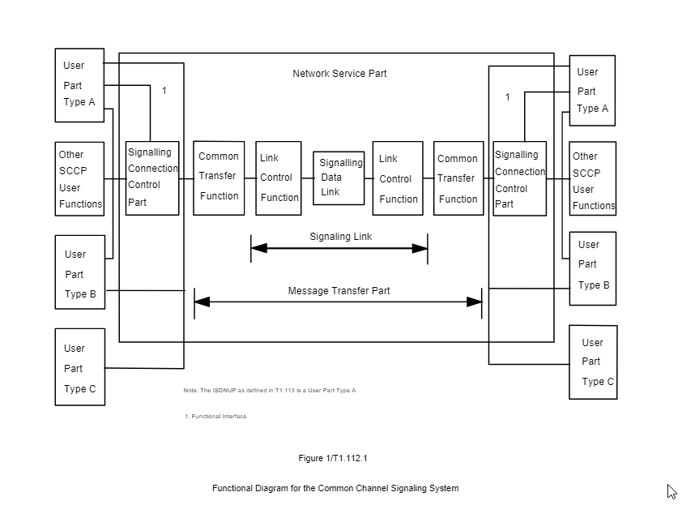

# 🟢 SCCP

SCCP is the transport layer and routing mechanism for TCAP messages. Enable SCCP on the SS7 stack if TCAP messaging is to be used.

<figure><figcaption></figcaption></figure>

### SCCP Global Titles

<figure><figcaption></figcaption></figure>

### SCCP SSNs

<figure><figcaption></figcaption></figure>
